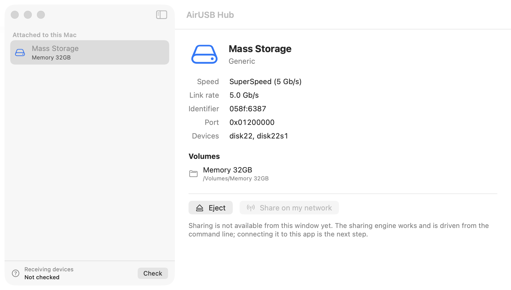

# AirUSB Hub

**Use a USB device that's plugged into another Mac, as if it were plugged into yours.**

The receiving Mac enumerates the device through its own USB stack and loads its own
drivers — a flash drive mounts as a normal volume, because as far as macOS can tell,
it really is attached. Not file sharing. The device itself is forwarded.

Peer to peer, LAN only. No cloud, no account, no server.



---

## Status

Early development. **Not usable yet** — the receiving half is blocked on an Apple
entitlement (see below).

| | |
|---|---|
| Sharing a device from a Mac | **works on real hardware** |
| Encryption and authentication | **done** — Noise_XX / Noise_IK |
| Receiving a device on a Mac | blocked on `com.apple.developer.usb.host-controller-interface` |
| Windows, Linux | later |

---

## How it works

```
 Mac A                                        Mac B
 ─────                                        ─────
 USB drive
    │  captured from the OS, unmounted
    ▼
 AirUSB exporter ──── encrypted, over your LAN ────► AirUSB importer
                                                          │
                                                          ▼
                                                 virtual USB host controller
                                                          │
                                                          ▼
                                                 macOS loads its own driver
```

Every peer can share and receive. There is no dedicated server.

**The sharing side is two processes**, because macOS requires it: capturing a device
and unmounting its disk need root, while opening a USB interface needs membership of
the console GUI session — and no process can be both. A root daemon captures; an
unprivileged agent moves the data.

**The receiving side needs a user-space USB host controller.** macOS provides exactly
one supported API for this, `IOUSBHostControllerInterface`, and it requires an
Apple-granted entitlement. No kernel extension, no SIP changes, no private APIs.

---

## Evidence

Verified against a real SuperSpeed flash drive (`058f:6387`, 31.5 GB), with both
halves running as real launchd jobs:

```
verdict=PASS  cbw=6 data=5 csw=6 stallRecoveries=0 boundariesIntact=yes
  INQUIRY              'Generic' 'Flash Disk' rev '8.01'
  READ_CAPACITY_10     61440000 blocks x 512 bytes = 31.46 GB
  READ_10_LBA0         512 bytes, residue=0, bootsig=55AA
  SHORT_READ_FIDELITY  offered 1024, device sent 512 — short read preserved
  READ_10_MULTIBLOCK   2048 bytes in one transfer, residue=0
restore: mount table matches 'before' exactly
```

A complete USB Mass Storage exchange, through pipes obtained across the process
split, with the drive handed back cleanly afterwards. The probe is read-only.

The Noise handshake is checked byte for byte against the official
cross-implementation test vectors, including the final handshake hash — a Noise
implementation that only talks to itself can be perfectly self-consistent and
completely wrong.

```
11 test suites, 0 failures
3 fuzz targets, 0 crashes
```

---

## Safety

A USB drive mounted in two places at once destroys its filesystem. AirUSB unmounts
the drive on the sharing Mac before handing it over, holds that claim for the whole
session, and gives it back cleanly. If it can't do that safely, it refuses.

While testing, use a drive you don't care about.

---

## Build

```bash
cd airusb
cmake -S . -B build && cmake --build build
(cd build && ctest)
```

The app:

```bash
cd apple && xcodegen generate
xcodebuild -project AirUSBHub.xcodeproj -scheme AirUSBHub \
           -destination 'platform=macOS' -allowProvisioningUpdates build
```

Requires macOS 13+, Xcode 26. Tested on macOS 26.5, Apple M1.

---

## Documentation

| | |
|---|---|
| [Feasibility](docs/P0_MACOS_FEASIBILITY.md) | Can this be built through supported APIs? Evidence and verdict. |
| [Architecture](docs/P1_IMPLEMENTATION_PLAN.md) | Wire protocol, concurrency, timeouts, test plan. |
| [Why two processes](docs/P1_CAPTURE_VERIFICATION.md) | What was measured on real hardware. |
| [The exporter](docs/P2_8_EXPORTER.md) | How sharing works, and the hardware evidence. |
| [Security](docs/P2_4_SECURITY.md) | What protects a session, and how it was verified. |
| [Entitlement](docs/ENTITLEMENT_REQUEST.md) | The one Apple-managed entitlement the receiving half needs. |

---

## License

To be determined before the first release.

Vendors [Monocypher](https://github.com/LoupVaillant/Monocypher) 4.0.3 (BSD-2 / CC0)
and the [BLAKE2](https://github.com/BLAKE2/BLAKE2) reference implementation (CC0),
unmodified — see [`airusb/third_party/PROVENANCE.md`](airusb/third_party/PROVENANCE.md).
Vendored rather than linked because the sharing daemon runs as root, and a library
loaded from a user-writable path would be a way to run code as root.
